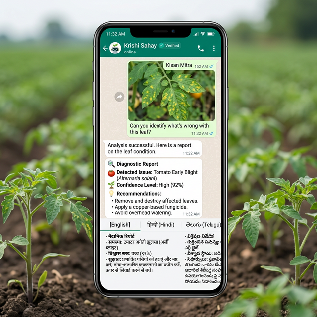

# Krishi Sahay

KrishiSahay is a project that uses technology to help farmers in India. It focuses on identifying crop diseases quickly and providing solutions that are good for the environment. 

Recently, the project has been upgraded from a WhatsApp bot into a fully-fledged **Modern Web Application**. This allows users to easily chat with the AI, select their preferred language (English, Hindi, Telugu), and upload pictures of their crops (like tomato or pepper leaves) directly from their web browsers without needing complex WhatsApp Business API setups.

## Features

- **Direct Web Chat**: Chat with the AI directly from any browser.
- **Instant Language Switching**: A simple dropdown menu allows you to switch between English, Hindi, and Telugu.
- **Image Uploading for Disease Detection**: Upload pictures of your crop leaves and the AI will analyze them for diseases and provide solutions.
- **WhatsApp Webhook Support**: The original WhatsApp webhook logic remains intact for side-by-side operation if a valid API token is provided.

## Team Members

[1. T. Nandakishore](NandaKIshore6743)  
[2. Athang Deshmukh](Athangdeshmukh)  
[3. Naredla Madhava Phani Bhooshith Reddy](Madhava-ds)  
[4. C. Sumanth](Sumanth-018)  
[5. Sai Prasad]

## Technologies Used

- **Frontend**: HTML5, CSS3, JavaScript (Glassmorphism design, vibrant colors)
- **Backend**: Flask (Python)
- **Database**: SQLite3
- **AI/ML**: Keras/TensorFlow (Image Classification), OpenAI/Gemini (Text Generation)
